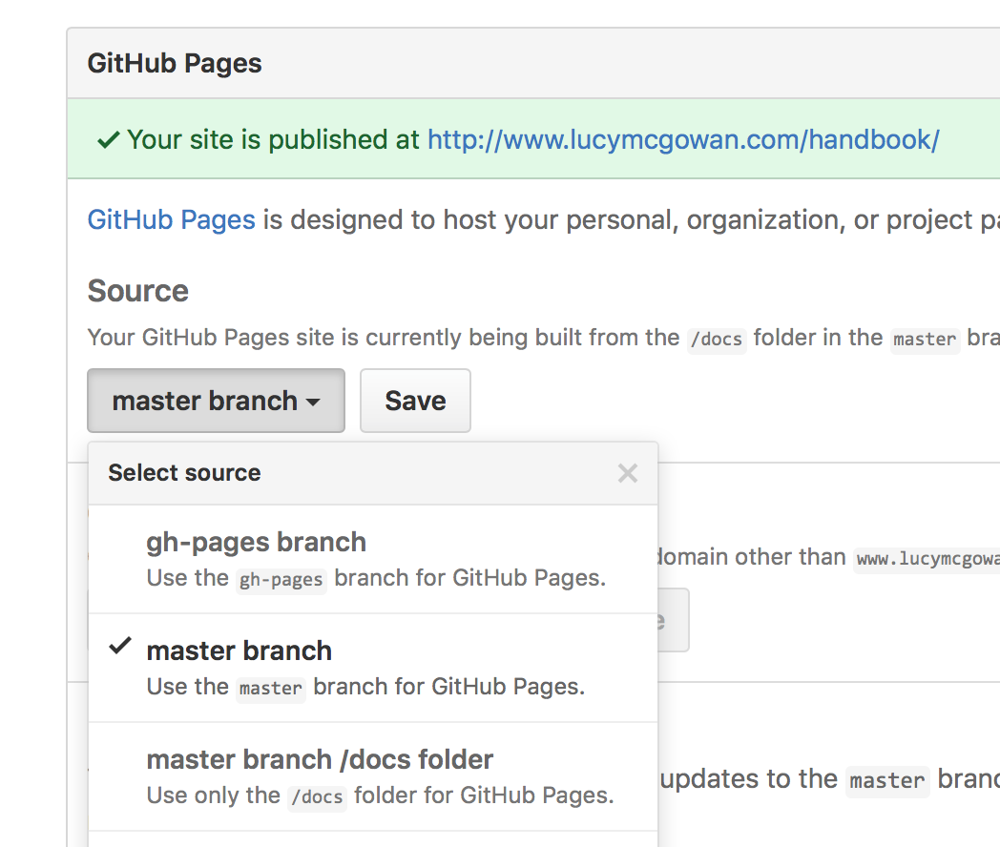

--- 
title: "Vanderbilt Biostatistics Graduate Student Handbook"
author: "Lucy D'Agostino McGowan,  Nathan James, Nick Strayer, Jonathan Chipman"
date: "`r Sys.Date()`"
site: bookdown::bookdown_site
output: bookdown::gitbook
documentclass: book
biblio-style: apalike
link-citations: yes
github-repo: lucymcgowan/handbook
description: "This is a handbook written by students for students in the Vanderbilt Biostatistics program"
---

# Introduction

Welcome to Vanderbilt's Biostatistics Graduate Program! We are so happy you are here. This is meant to serve as a bit of a manual for incoming students to help your transition go a bit smoother. We have compiled our best & wildest advice into a beautiful [bookdown](https://bookdown.org/yihui/bookdown/) book. ENJOY (or else...)


<!--chapter:end:index.Rmd-->

# Computing Tips {#computing}

Most (read: all-2) of the students here use macs. It is not required, but it will make your life easier. These are some tips that I feel have made me successful, but there are definitely other ways to do it.

## Downloads

Here are some things you should get on your computer before you get started. 

### Homebrew
Install homebrew. Homebrew is essentially a package manager. Paste the command below in your terminal prompt.

```
/usr/bin/ruby -e "$(curl -fsSL https://raw.githubusercontent.com/Homebrew/install/master/install)"
```

After doing that double check that you've got it installed correctly by running
```
brew doctor
```

If you see `Your system is ready to brew` you are good to go. You install packages by running `brew install package-name`, for example `brew install git` to install git (which you should do RIGHT NOW if you don't have it yet).

Some things I recommend getting now that you have brew installed:

* git
* python 
* cowsay
* thefuck

### Bash-it
Make your terminal beautiful. 

I really like Bash-it. Both because I like to say it outloud, and because it makes my terminal look baller. It has sweet plugins (like showing git branches!) and awesome aliases that will save your pretty little fingers.

To install, type this in terminal,

```
git clone https://github.com/revans/bash-it.git ~/.bash_it
```

then run,

```
 ~/.bash_it/install.sh
```

I use a slightly edited `bobby` theme. [Here](https://github.com/Bash-it/bash-it/wiki/Themes) are some other themes to choose from.

### R

If you don't already have it, download [`R`](https://cran.r-project.org) & if you'd like [RStudio](https://www.rstudio.com/products/rstudio/#Desktop)


## File Organization

File organization is super important. And fun! There are a lot of different conventions, I took a while iterating towards one I actually really like. 

### Naming conventions

Since we have gone to so much effort to make our terminal look dope, we should be congizent of how to name folders to most easily use it (for example, folder and file names with spaces are a pain because you have to add quotation marks).

* Instead of spaces, uses - between words for folder & filenames
* name folders consistently within projects to allow you to reuse functions/run scripts (more below)


### Folders

I have 3 main folders:

* `phd `
* `working`
* `archive`

The `phd` folder is pretty self explanatory. Within this folder I have:

* `courses`
* `journal-club`
* `teaching`

The `working` folder contains projects I am actively working on. This includes RA work, projects I am working on with professors, consulting, and tutoring files. I have these separated because I am acutely aware of making sure these are backed up regularly on github. Within each of these, I have:

* `code`
* `data`
* `reports`
* `src`

The consistent naming convention allows me to have set code to run everything for each different project I am on. The `src` folder is especially useful for holding functions I have written that I reuse a bazillion times. 

The `archive` folder contains projects that I have completed. These are backed up every time a new folder is added, but not as regularly as the `working` folder.

## Github

If you do not already have one, set up a [github account](https://github.com) -- make sure that you get an [education discount](https://education.github.com/) so you can set up private repos.


* Jenny Bryan has an awesome course on [Github for the useR](http://happygitwithr.com/). 
* For some [giggles](http://www.commitlogsfromlastnight.com)

## Bash Profile

Now that we've downloaded a bunch of nifty programs using `brew` and we have `github` up & running, you can save some typing time in terminal by adding aliases (shortcuts) to your `.bash_profile`. 

1. Open Terminal and type `open -e ~/.bash_profile` (if you installed bash-it this will work, if you do not have a `.bash_profile` in your home directory yet, you can create one using your favorite text editor, for example `nano .bash_profile`)
2. Add some aliases like this:
`alias alias_name = "terminal command"`

For example: 

```
# Edit profile
alias edit_profile="open -e ~/.bash_profile"
```

Here are some we $\heartsuit$:

```
# Set RStudio alias
alias RS="open -a RStudio"

# Set reload profile alias
alias reload_profile=". ~/.bash_profile"

# Edit profile
alias edit_profile="open -e ~/.bash_profile"

#Lazy git - will add commit and push with one command

#Set our default branch to push to as the one we are in
git config --global push.default current

 function lgit() {
     git add -A
     git commit -m "$1"
     git push
}
```

## Statistical Software

In this department, we conduct the majority of our analyses using `R` & `python`. We use `Stata` for one class, so you may want to get that as well. If you are interested in learning SAS, check [this](https://support.sas.com/edu/schedules.html?ctry=us&id=2588) out.

<!--chapter:end:01-computer.Rmd-->

# Biostatistics Graduate Student Association {#bgsa}

The Biostatistics Graduate Student Association was founded in 2016 by a group of enthusastic students who were particularly excited about getting food at journal club, nerdy t-shirts, and sharing knowledge. It is a recognized organization of Vanderbilt University as well as an ASA student chapter. Currently, it functions primarily to host bi-monthly student-run Journal Clubs. Information about electing officers is included in the constitution ($\S$ \@ref(bgsa-constitution-officers)).

## Mission

We seek to facilitate an environment for students to engage in discussions regarding biostatistics and data science concepts in order to further their knowledge and understanding of the current state of the field.

## Constitution {#bgsa-constitution}

BIOSTATISTICS GRADUATE STUDENT ASSOCIATION CONSTITUTION

### ARTICLE I
NAME OF CLUB

The name of this club is Biostatistics Graduate Student Association.

### ARTICLE II
PURPOSE OF CLUB

The purpose of the Biostatistics Graduate Student Association is to facilitate an environment for students to engage in discussions regarding biostatistics and data science concepts in order to further their knowledge and understanding of the current state of the field.

### ARTICLE III
MEMBERSHIP

The Biostatistics Graduate Student Association encompasses all biostatistics graduate students as well as students with an interest in biostatistics/data science. 

### ARTICLE IV {#bgsa-constitution-officers}
QUALIFICATION AND ELECTION OF OFFICERS

Section 1.
Officers must be currently enrolled and maintain full-time student status. 


Section 2.
The Executive Board will consist of four officer positions. There will be a President, Vice President, Secretary, and Treasurer.


Section 3.
New officers will be nominated and elected by club members at the completion of the academic year. 

### ARTICLE V
DUTIES OF OFFICERS

Section 1.
President

A.	Introduce all meetings
B.	Carry out the provisions of the constitution

Section 2.
Vice President

A.	Assume the duties of the president in his/her absence
B.	Perform any duties delegated by president
C.	Actively participate in planning club functions

Section 3.
Secretary

A.	Maintain the list of presenters and ensure that information about the presentations is disseminated to all members
B.	Maintain attendance records.

Section 4.
Treasurer

A.	Maintain the club’s budget
B.	Pay all charges, collecting all receipts, maintaining a balanced account, and presenting financial information to the Executive Board at least once every semester. 
C.	The Treasurer will perform such duties as are delegated to him or her by the President. 
D.	The Treasurer shall serve as the official liaison between the club and the Student Finance Committee of Vanderbilt University (also known as the Activity Fee Committee).

### ARTICLE VI
ADVISOR

Section 1.
The role of the advisor is to:
A.	Serve as the official staff representative of the club.

### ARTICLE VII
RESPONSIBILITIES

Section 1. 
This club accepts full financial responsibility for all activities that bear its name as official sponsor, and will adhere to college regulations.

### ARTICLE VIII
AMENDMENTS
This Constitution may be amended by a two-thirds vote of active members, which will follow the presentation of a petition containing the proposed amendment.

## Website

You can find more information [here](https://anchorlink.vanderbilt.edu/organization/Biostatistics).

<!--chapter:end:02-bgsa.Rmd-->

# Conferences {#conferences}

Here is a (brief) list of conferences that we like to attend:

conference | time of year | abstracts due | student scholarships
-----------|--------------|---------------|----------------------
ENAR       | March        | early/mid October | available
JSM        | 1st week of August | student awards: Nov/Dec | [available](https://www.amstat.org/asa/education/Student-Paper-Competition-Travel-Award-to-Attend-the-Joint-Statistical-Meetings.aspx)
WSDS       | late October | -- | available
useR       | June/July    | February | available
APHA       | late October/early November | March | available
SAS Global Forum | April | September/October | [available](https://support.sas.com/learn/ap/student/amb.html)
## Scholarships

Students in our department have had success applying to the following funding sources

* We have had two 1st place successes for the Government Statistics Section [Data Challenge](http://community.amstat.org/governmentstatisticssection/new-item2/new-item). 
    * Chat with [Alice](http://www.vanderbilt.edu/biostatistics/graduate/students/Alice-toll/), [Ryan](http://www.vanderbilt.edu/biostatistics/graduate/students/Ryan-Jarrett/), or [Lucy](http://www.vanderbilt.edu/biostatistics/graduate/students/lucy-dagostino-mcgowan/) for more information.
* Women in Statistics and Data Science Travel Award. 
    * Chat with [Alli](http://www.vanderbilt.edu/biostatistics/graduate/students/allison-hainline/), [Jacquelyn](http://www.vanderbilt.edu/biostatistics/graduate/students/jacquelyn-neal/), [Hannah](http://www.vanderbilt.edu/biostatistics/graduate/students/Hannah%20Weeks/), or [Lucy](http://www.vanderbilt.edu/biostatistics/graduate/students/lucy-dagostino-mcgowan/) for more information.
* useR Student Scholarship
    * Chat with [Laurie](http://www.vanderbilt.edu/biostatistics/graduate/students/lauren-samuels/) for more information.
* APHA Applied Public Health Statistics section Student Paper Award
    * Chat with [Lucy](http://www.vanderbilt.edu/biostatistics/graduate/students/lucy-dagostino-mcgowan/) for more information. 
* SAS Global Forum Student Ambassador
    * Chat with [Lucy](http://www.vanderbilt.edu/biostatistics/graduate/students/lucy-dagostino-mcgowan/) for more information. 

<!--chapter:end:03-conferences.Rmd-->

# Personal Website

```{r setup, include=FALSE}
knitr::opts_chunk$set(echo = TRUE)
```

## Setup: 

Today, more than ever, a website is like a business card. As a graduate student or academic, by having a nice website you are not only providing a one-stop-shop for all of your necessary information, you are showing that you are savvy enough to know the importance of a high-quality web-presence, and lastly you are illustrating that you have the technical prowess to accomplish this. 

## Prerequisits: 

- Github account 
    - Don't have one? [Get one!](http://docs.railsbridge.org/installfest/create_a_github_account)
- Working knowledge of RMarkdown. 
    - [What is RMarkdown](https://www.r-bloggers.com/r-markdown-and-knitr-tutorial-part-1/) you ask?
- Temporarily narcissistic mind-frame. 

## Goals: 

By the end of this (hopefully) you will have,

- constructed a simple website with basic information about yourself, 
- hosted it to github for the world to access, 
- have enough knowledge to know what to google to make it better. 

Okay, let's get started.

---

## Step 1: Git on with it. 

First things first, let's set up our github repository for hosting this site. 

__"Hosting this site"?__

Whenever you go to a website, e.g. www.Vanderbilt.edu, your computer is sending out a request across the series of tubes known as the internet to a server sitting on top of some cloud somewhere (aka Indiana) that it would like to look at Vanderbilt's website. That server, which is simply another computer, receives the request, then goes into its hard-drive and pulls up the file it has stored for Vanderbilt.com and sends that file back to your computer. So when we say "host your site" we simply mean we need to find a server to put your website's files on that will then deliver those sites to people who want to see them via their web browser of choice. 

This all sounds very complicated and expensive, and it used to be, but now computation is so cheap that companies literally give away server space to people all the time. One example of this is github. Every time you host a repository on github it is stored on a server for access. 

__Create Repo__

Click the plus icon in the upper right corner of your github page and select `New repository`. 


Set up the repo how you like. In this case I am choosing "initialize repo with a README" so that I can just clone the empty repo to my computer and not bother with `git init`ing. But this is entirely up to you. If you have github you most likely already know how to do this. If you'd like this to be your main website, name this repo `yourgithubname.github.io` for example, Nick's would be `nstrayer.github.io`, Lucy's would be `lucymcgowan.github.io`, etc.


Now select "Clone or download" and copy the link that pops up. 


Now open your terminal, navigate to the area where you want to story your website on your local computer and then type in...

```{bash, eval = FALSE}
git clone https://github.com/nstrayer/personal_site.git  #<- Replace this with your personal link. 
```

There are multiple ways to host websites on github. One is to create a new branch called `gh-pages`, the other is to tell github to manually tell github look in the master branch. We will do it the latter way. 

```{bash, eval = FALSE}
cd personal_site/  #<- Again, replace this with your own folder name
```

This navigates you into your new repo.

Now we need to let github know that we want it to look for files to host in our master branch. Navigate to your repository and click Settings on the top right.


Scroll down to the Github Pages section and click the drop down menu under "Source" and click "master branch". 



Okay good! Now we have a repo setup that allows us to host websites to it. Now let's actually get a website on it!

---

## Start your Markdowns!

First we do some administrative work to make sure we don't run into roadblocks on the way. Let's update our `rmarkdown` package to make sure we actually have the version that supports RMarkdown websites. 

```{r, eval = FALSE}
install.packages("rmarkdown", type = "source")
```

Next we need to create a couple empty files inside your repository. 

```{bash, eval=FALSE}
touch _site.yml #"YML" file that tells your website how to assemble itself
touch index.Rmd #Create the main rmd file
touch about.Rmd #Create an about file
```

Now open all of these files in RStudio. 

We will start by filling out the `yml` file. `yml` files, while confusing looking at first, are basically a road-map for R to know how to assemble your website. 


___site.yml__
```{r, eval = FALSE}
name: "nicks-website"
output_dir: "."
navbar:
  title: "Nicks Website"
  left:
    - text: "Home"
      href: index.html
    - text: "About Me"
      href: about.html
```

Next we will fill out the bare minimum for the `.Rmd` files. 

__index.Rmd__
```{r, eval = FALSE}
---
title: "Nick's Website"
---

Hello, World!
```

__about.Rmd__
```{r, eval = FALSE}
---
title: "About Me"
---

Why I am awesome. 
```

_If you got lost at any point during this tutorial, you can download a template of these files from [Lucy's github](https://github.com/LucyMcGowan/Example-RMarkdown-site)._

## Let's build it!

Okay, one last step to actually have a functioning website. We need to actually turn these separate files into a single cohesive website. 

To do this we are going to create one more file. This time just a plain r script. 

```{bash, eval=FALSE}
touch build_site.R
```

__build_site.R__
```{r, eval = FALSE}
#Set our working directory. 
#This helps avoid confusion if our working directory is 
#not our site because of other projects we were 
#working on at the time. 
setwd("/Users/Nick/personal_site")

#render your sweet site. 
rmarkdown::render_site()
```

As a note, you could skip this step if you had started by creating an RStudio project, however, by doing it this way we are not dependent upon RStudio itself. This could be helpful if in the future you are doing this on a computer without RStudio. It also helps explain the process a little bit more. 

Now if everything has gone according to plan, by running the code in `build_site.R` you should get a bunch of unintelligible output followed by the message : `Output created: index.html`. If so, yay, if not, double check all the stuff above to make sure you followed it exactly. Or more likely I messed up and you should inform me. 

Now we can open it up. Open the repository with `finder` or whatever tool your computer uses to look at files then click on `index.html` and hopefully you should get something that looks like this. 


Sweet. You have now created your own personal website. First let's push it to github and then we can get down to making it good for you. 


## Git it hosted

Now we just have to add commit and push everything to github. 

```{bash, eval=FALSE}
#Let's add all the files to our git staging area
git add -A #the -A flag tells it git you want everything

#Now we can commit
git commit -m "My first website commit. The begining of greatness"

#Now we push. Note the addendum to normal pushing
git push origin master
```

Now we can navigate to our hosted site! Open your browser of choice and go to `www.<your github name>.github.io/<your sites repo name>`. (E.g. `www.nstrayer.github.io/personal_site`). 

_Note: github has to build stuff on its end so it may take a minute or so for stuff to show up. Just keep impatiently refreshing the page and it will go faster._

Yay, it works. Now we can make it better. 

## Show the world who you are. 

You know how to use RMarkdown. So basically everything that you know how to do you can do here. 

Like let's say you want to make your about page more descriptive. 

__about.Rmd__
```
---
title: "About Me"
---

- __Name:__ Nick
- __Ocupation:__ "Student"
- __Hobbies:__ Learning software development instead of studying for exams. 

Here is a super cool photo of me doing one of my favorite things, yawning. 


```

Now just rebuild your site by running `build_site.R` again and open `index.html` again to see if it worked. Ideally now 
you should be able to click on your about page and see the new results! 


Oh my, that photo looks mighty large. Perhaps we want to make it smaller. We can do that, by adding a special styling file called a `css` file. Back to the terminal...


```{bash, eval=FALSE}
touch style.css
```

Now open this file up in R and add the following lines: 

__style.css__
```
img {
  width: 400px;
  display: block;
  margin: 0 auto;
}
```

This takes every image that appears on our site and makes them 400 pixels wide and centers them. You can change these parameters as you want. There are infinitely many ways to customize the style of a website using css. For more information try googling `how to <do something> with css` and you will most likely find 10,000 ways to do it. 

Now just add the following lines to your `_site.yml` file to apply this css to your site. 

___site.yml__
```{r, eval = FALSE}
name: "nicks-website"
output_dir: "."
navbar:
  title: "Nicks Website"
  left:
    - text: "Home"
      href: index.html
    - text: "About Me"
      href: about.html
output:
  html_document:
    theme: flatly
    css: style.css
```

We have done a few things here. One we have created the new `output` field. We have given it a theme (you can choose from any you desire [here](http://bootswatch.com/)) and we have added our custom css file to the whole thing as well. 

Once again, run `build_site.R` to checkout how things have changed. 


Looking a lot better. 

You are a biostatistician however, so how about we try and show that off. 

## Add Projects/ other links

Let's make a page with links to your cool (open) projects. 

Again we edit the `_site.yml` file... 

___site.yml__
```{r, eval = FALSE}
name: "nicks-website"
output_dir: "."
navbar:
  title: "Nicks Website"
  left:
    - text: "Home"
      href: index.html
    - text: "Projects"     ##### the new
      href: projects.html  ##### stuff
    - text: "About Me"
      href: about.html
output:
  html_document:
    theme: flatly
    css: style.css
```

Add another file called `projects.Rmd` (you know how to do this at this point). 

__projects.Rmd__

```{r, eval = FALSE}
---
title: "Projects"
---

Sometimes I like to do projects and then post them on the internet for the whole world to benefit!
here's some examples. 

## [Data Visualization in R](http://nickstrayer.me/visualization_in_r/)

- An RMarkdown presentation on the common mistakes made in visualization and how to fix them.
- Includes a github repo for access to all the code.
- Look at how high quality my work is, hire and or collaborate with me. 

## [Statistical Plots](http://bl.ocks.org/nstrayer/37a503dd1db369a8f7e3ce21757e19ee)

- Interactive plots of things
- I can code!
```

Again, build the site with your build script and then take a look at what you have!


## So what now?

Well first off you add, commit, and push all your new fancy changes to github. 

Now you have a website that is better than 95% of people in your situation. What do you do now? 

You never stop making it better! Every new project you get you do you post it to your projects page, get sick new head shots in? Add that to your about page. Customize it. For instance you may want to add a splash of personalization to your main page. Perhaps a nice chart? Ever made a plot in an RMarkdown before? You know how to do it then. 


__index.Rmd__
```
---
title: "Nick's Website"
---

__Look at how cool this plot is!__

$$Y = \alpha \cdot \sin(X), \alpha = 0,0.1,0.2,...,3$$


#remove backslashes before ticks to get this to work. 
\`\`\`{r, echo = FALSE, fig.align='center'}
library(tidyverse)
cool_function <- function(x, alpha) return(sin(alpha*x))
xs <- seq(0, pi*1.5, 0.005)
ys <- cool_function(xs, 1)
results <- data_frame(xs, ys, alpha = "1")
for(alpha in seq(0,3, 0.1)){
  results <- results %>% 
    bind_rows(data_frame(
      xs, 
      ys = cool_function(xs, alpha),
      alpha = as.character(alpha)
    ))
}

ggplot(results, aes(x = xs, y = ys, color = alpha)) + 
  geom_line() + 
  theme_bw() + 
  theme(legend.position="none")
\`\`\`
```

## Afterward

__Learn More__

If you want to learn more about what's possible using RMarkdown sites (and there is a lot), a good starting place is [this document](http://rmarkdown.rstudio.com/rmarkdown_websites.html) hosted by RStudio. This is where I got almost everything for this. 

__Style__

This is rather personal, but as for the style: keep it as simple as possible. The simpler your website the less overwhelming it is to viewers. Try and convey everything that you need to and nothing more. That being said, personal flourishes do sometimes help set you apart from others. It's a balancing act. 

__Questions__

If this tutorial was confusing or you don't know what words to use to search for new stuff feel free to contact us. 

- Nick
    - n.strayer at Vanderbilt.edu
    - [twitter](https://twitter.com/NicholasStrayer)
    - [github](https://github.com/nstrayer)
- Lucy
    - ld.mcgowan at Vanderbilt.edu
    - [twitter](https://twitter.com/LucyStats)
    - [github](https://github.com/LucyMcGowan)


<!--chapter:end:04-website.Rmd-->

# Useful Math Facts {#math}

## Exponents and Logarithms
for positive constants $a$ and $b$:

$a^0 = 1$

$a^{-n}=\frac{1}{a^n}$ for positive integer $n$

$a^{x+y}=a^x a^y$

$a^{x-y}=\frac{a^x}{a^y}$

$(a^x)^y=a^{xy}$

$(ab)^x=a^xb^x$


$\log_a(x) = y$ implies $a^{y} = x$

If you're working in statistics it's usually a safe bet that $\log(x)$ means $\log_e(x)$ not $\log_{10}(x)$.

$\log(1) = 0$

$\log(e) = 1$

$\log(xy)=\log(x) + \log(y)$

$\log(x/y)=\log(x)-\log(y)$

## Sequences and Series

### Monotonicity

A sequence of numbers $\{x_1,x_2,\ldots\}$ is *monotone increasing* if $x_n \le x_{n+1}$ for all $n$. If $x_n \ge x_{n+1}$ for all $n$, the sequence is *monotone decreasing*

### Geometric series

$\sum\limits_{k=0}^{n} a^k =\frac{1- a^{n+1}}{1-a}$

for $|a|<1$ $\sum\limits_{k=0}^{\infty} a^k =\frac{1}{1-a}$

### Taylor series

$e^x=\sum\limits_{n=0}^{\infty}\frac{x^n}{n!}$

### Binomial Theorem

$(x+y)^n = \sum\limits_{k=0}^{n}\binom{n}{k}x^{k}y^{n-k}$

## Calculus - Derivatives

### Maxima and Minima

## Calculus - Integrals

## Miscellaneous

### Gamma function

The Gamma function is defined as $\Gamma(\alpha) =\int\limits_{0}^{\infty}x^{\alpha-1}e^{-x}\, dx$ for $\alpha > 0$

$\Gamma(1)=1$

$\Gamma(\alpha)=(\alpha-1)\Gamma(\alpha-1)$

$\alpha\Gamma(\alpha)=\Gamma(\alpha+1)$

$\Gamma(n)=(n-1)!$ for integer $n>0$


<!--chapter:end:05-math.Rmd-->

